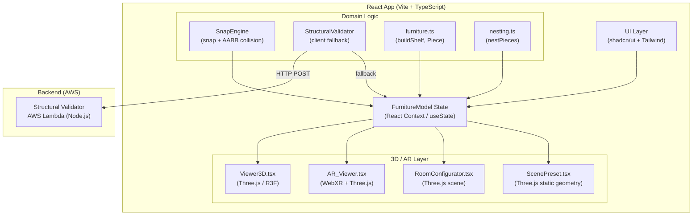
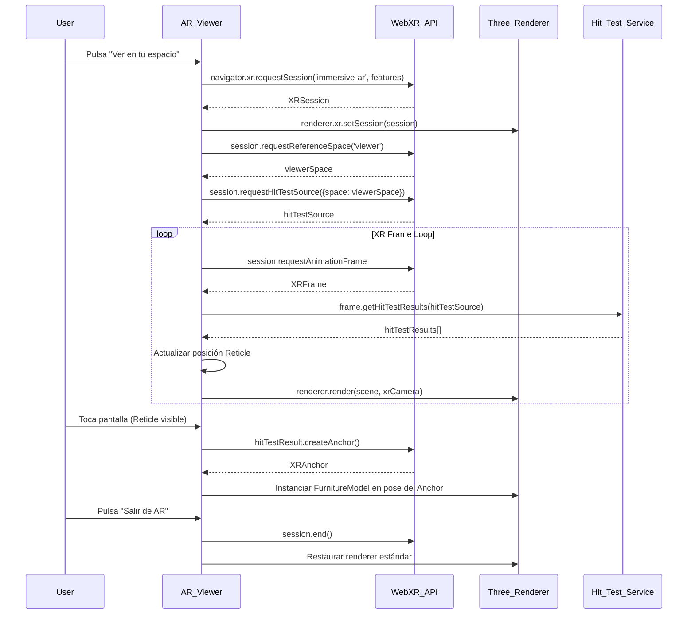

# Design Document — Furniture Design Platform

## Overview

FormCraft evoluciona desde un configurador paramétrico de estanterías hacia una plataforma completa de diseño modular de muebles con tres capacidades avanzadas:

1. **Sistema Modular de Building Blocks** — ensamblaje libre por arrastre con snap automático a 20 mm, detección de colisión AABB y grafo de ensamblaje.
2. **Entornos Contextuales** — tres niveles: Scene Presets predefinidos (Nivel A), Room Configurator con obstáculos (Nivel B) y Realidad Aumentada con WebXR (Nivel C).
3. **Validación Estructural Backend** — función AWS Lambda que evalúa pandeo por material y retorna alertas con piezas afectadas.

El foco de detalle es el **Nivel C: AR con WebXR API**, que permite proyectar el mueble diseñado sobre el espacio físico real del usuario directamente desde el navegador móvil, sin instalar ninguna aplicación nativa.

### Decisiones de diseño clave

- **Reutilización del renderer Three.js existente**: `Viewer3D.tsx` ya usa `@react-three/fiber`. La sesión AR se habilita con `renderer.xr.enabled = true` sobre el mismo `WebGLRenderer`, evitando duplicar la escena.
- **Separación de responsabilidades**: cada capacidad nueva se implementa como módulo independiente (`SnapEngine`, `StructuralValidator`, `RoomConfigurator`, `ARViewer`) que se integra con el estado central de `FurnitureModel`.
- **Degradación elegante**: todas las funcionalidades avanzadas (AR, Lambda, snap) tienen fallbacks que mantienen la experiencia base funcional.
- **Unidades**: el modelo de datos usa milímetros (mm); Three.js usa metros (m) con factor de conversión `MM = 0.001`.

---

## Architecture

### Diagrama de alto nivel



### Flujo de sesión AR



---

## Components and Interfaces

### AR_Viewer (`src/components/ARViewer.tsx`)

Componente React responsable de toda la sesión WebXR AR.

```typescript
interface ARViewerProps {
  furnitureModel: FurnitureModel;   // modelo activo del diseñador
  onExit: () => void;               // callback al salir de AR
}

interface ARViewerState {
  supportStatus: 'checking' | 'supported' | 'unsupported' | 'no-webxr';
  sessionStatus: 'idle' | 'active' | 'error';
  reticleVisible: boolean;
  modelPlaced: boolean;
  currentAnchor: XRAnchor | null;
  rotationY: number;                // grados, múltiplos de 15
}
```

**Responsabilidades:**
- Detectar soporte WebXR (`navigator.xr.isSessionSupported`)
- Gestionar ciclo de vida de la sesión (`requestSession`, `session.end()`)
- Coordinar `HitTestService` y `DOMOverlay`
- Renderizar `FurnitureModel` en la escena AR con escala 1:1

### HitTestService (`src/lib/ar/hitTestService.ts`)

Módulo puro que encapsula la lógica de hit-test WebXR.

```typescript
interface HitTestService {
  initialize(session: XRSession, viewerSpace: XRReferenceSpace): Promise<void>;
  getClosestHit(frame: XRFrame): XRHitTestResult | null;
  dispose(): void;
}

interface ReticleState {
  visible: boolean;
  pose: XRRigidTransform | null;
}
```

### SnapEngine (`src/lib/snap/snapEngine.ts`)

Motor de snap, colisión y jerarquía padre-hijo para el sistema de Building Blocks.

```typescript
interface BuildingBlock {
  id: string;
  type: BlockType;                  // 'side-panel' | 'shelf' | 'drawer' | 'back-panel'
  position: THREE.Vector3;
  size: THREE.Vector3;              // dimensiones en mm
  connections: ConnectionEdge[];    // aristas del grafo de ensamblaje

  // --- Punto 3: Sentido de veta ---
  grainDirection: 'horizontal' | 'vertical' | 'none';

  // --- Punto 4: Jerarquía padre-hijo ---
  parentId: string | null;          // null = bloque raíz

  // --- Punto 1: Tapacanto ---
  edgeBanding: EdgeBandingConfig;

  // --- Punto 5: Validación visual preventiva ---
  visualValidationStatus: 'ok' | 'warning' | 'error';
}

type BlockType = 'side-panel' | 'shelf' | 'drawer' | 'back-panel';

// --- Punto 1: Tapacanto ---
type FaceName = 'front' | 'back' | 'left' | 'right' | 'top' | 'bottom';

interface EdgeBandingConfig {
  faces: Partial<Record<FaceName, EdgeBandingFace>>;
}

interface EdgeBandingFace {
  thicknessMm: number;              // típicamente 0.5 mm (PVC fino) o 1 mm (ABS)
  material: 'pvc' | 'abs' | 'wood-veneer';
}

interface ConnectionEdge {
  fromBlockId: string;
  toBlockId: string;
  fromFace: FaceIndex;              // 0-5 (±X, ±Y, ±Z)
  toFace: FaceIndex;
}

interface SnapResult {
  snapped: boolean;
  targetPosition: THREE.Vector3;
  highlightFace: FaceIndex | null;
  connectionEdge: ConnectionEdge | null;
}

interface SnapEngine {
  SNAP_THRESHOLD_MM: 20;

  // Calcula si un bloque en movimiento debe hacer snap
  computeSnap(
    movingBlock: BuildingBlock,
    allBlocks: BuildingBlock[]
  ): SnapResult;

  // Verifica colisión AABB entre dos bloques
  checkAABBCollision(a: BuildingBlock, b: BuildingBlock): boolean;

  // Registra conexión en el grafo de ensamblaje
  registerConnection(edge: ConnectionEdge, graph: AssemblyGraph): AssemblyGraph;

  // --- Punto 4: Jerarquía padre-hijo ---
  // Retorna todos los bloques cuyo parentId === blockId
  getChildren(blockId: string, blocks: BuildingBlock[]): BuildingBlock[];

  // Aplica el delta de movimiento del padre a todos sus hijos (recursivo).
  // RENDIMIENTO: función pura, debe ejecutarse fuera del ciclo de renderizado
  // de Three.js. Durante el drag, el resultado se almacena en un ref mutable
  // y se aplica al estado React solo en onDragEnd. Si se detecta lag con
  // > 30 piezas, migrar el estado de bloques a Zustand.
  propagateMovement(
    parentId: string,
    delta: THREE.Vector3,
    blocks: BuildingBlock[]
  ): BuildingBlock[];
}
```

**Regla de establecimiento de jerarquía**: cuando un bloque hace snap a un `side-panel`, el `side-panel` se convierte automáticamente en padre (`parentId = side-panel.id`). La jerarquía se rompe si el bloque hijo se arrastra fuera del radio de snap del padre.

### AssemblyGraph (`src/lib/snap/assemblyGraph.ts`)

Grafo de ensamblaje del mueble, usado por el validador estructural.

> **Invariante de integridad**: el grafo nunca debe contener aristas huérfanas. `removeNode` es una operación atómica que elimina el nodo del Map **y** filtra todas las `ConnectionEdge` donde `fromBlockId === id` o `toBlockId === id` antes de retornar. Si quedara una arista apuntando a un ID inexistente, `StructuralValidator` fallaría al recorrer el grafo.

```typescript
interface AssemblyGraph {
  nodes: Map<string, BuildingBlock>;
  edges: ConnectionEdge[];
}

// Serialización para envío a Lambda
interface AssemblyGraphPayload {
  nodes: Array<{
    id: string;
    type: BlockType;
    position: { x: number; y: number; z: number };
    size: { x: number; y: number; z: number };
    material: MaterialType;
    // --- Punto 3: Sentido de veta (para que Lambda también lo considere) ---
    grainDirection: 'horizontal' | 'vertical' | 'none';
    // --- Punto 4: Jerarquía padre-hijo ---
    parentId: string | null;
  }>;
  edges: ConnectionEdge[];
  // --- Punto 2: Saw Kerf en el payload de exportación ---
  sawKerfMm: number;
}
```

### StructuralValidator (`src/lib/validation/structuralValidator.ts`)

```typescript
type MaterialType = 'melamine-18' | 'mdf-18' | 'solid-wood-20';

interface MaterialSpec {
  type: MaterialType;
  thickness: number;                // mm
  maxSpanMm: number;                // límite de pandeo en mm
}

// Configuración de materiales (también en Lambda)
const MATERIAL_SPECS: Record<MaterialType, MaterialSpec> = {
  'melamine-18': { type: 'melamine-18', thickness: 18, maxSpanMm: 800 },
  'mdf-18':      { type: 'mdf-18',      thickness: 18, maxSpanMm: 700 },
  'solid-wood-20': { type: 'solid-wood-20', thickness: 20, maxSpanMm: 1000 },
};

interface ValidationResult {
  valid: boolean;
  alerts: ValidationAlert[];
  source: 'lambda' | 'client-fallback';
}

interface ValidationAlert {
  affectedPieceIds: string[];
  spanMm: number;
  maxAllowedMm: number;
  material: MaterialType;
  message: string;
}

// --- Punto 5: Resultado de validación local de span ---
interface SpanValidationResult {
  status: 'ok' | 'warning' | 'error';
  spanMm: number;
  maxAllowedMm: number;
  // 'warning' cuando span > maxSpanMm * 0.9 (zona de precaución)
  // 'error'   cuando span > maxSpanMm
}

interface StructuralValidator {
  // Validación completa asíncrona (llama a Lambda)
  validate(graph: AssemblyGraph, material: MaterialType): Promise<ValidationResult>;

  // --- Punto 5: Validación local síncrona durante drag-and-drop ---
  // Se ejecuta en cada frame durante el arrastre, sin llamar a Lambda.
  // Actualiza block.visualValidationStatus y el material Three.js del bloque.
  validateSpanLocally(
    block: BuildingBlock,
    neighbors: BuildingBlock[],
    material: MaterialType
  ): SpanValidationResult;
}

// Colores de validación visual (Three.js MeshStandardMaterial color override)
const VALIDATION_COLORS = {
  ok:      null,        // sin override — usa el color base del material
  warning: '#FF8C00',   // naranja
  error:   '#FF0000',   // rojo
} as const;
```

### RoomConfigurator (`src/components/RoomConfigurator.tsx`)

```typescript
interface RoomDimensions {
  lengthMm: number;
  widthMm: number;
  heightMm: number;
}

type WallSide = 'north' | 'south' | 'east' | 'west';

interface RoomObstacle {
  id: string;
  type: 'window' | 'door';
  wall: WallSide;
  heightFromFloorMm: number;
  widthMm: number;
  heightMm: number;
  offsetFromLeftMm: number;
}

interface RoomConfiguration {
  dimensions: RoomDimensions;
  obstacles: RoomObstacle[];
}

interface RoomConfiguratorProps {
  furnitureModel: FurnitureModel;
  onConfigChange: (config: RoomConfiguration) => void;
}
```

### ScenePreset (`src/lib/scene/scenePresets.ts`)

```typescript
type PresetId = 'kitchen' | 'bedroom' | 'living-room';

interface ScenePreset {
  id: PresetId;
  labelEs: string;
  ambientIntensity: number;
  directionalIntensity: number;
  directionalPosition: [number, number, number];
  wallColor: string;
  floorColor: string;
  roomDimensions: RoomDimensions;
}

const SCENE_PRESETS: Record<PresetId, ScenePreset> = {
  'kitchen':     { id: 'kitchen',     labelEs: 'Cocina básica',        ... },
  'bedroom':     { id: 'bedroom',     labelEs: 'Dormitorio minimalista', ... },
  'living-room': { id: 'living-room', labelEs: 'Salón moderno',        ... },
};
```

### FurnitureModel (estado central)

```typescript
interface FurnitureModel {
  // Modo paramétrico (existente)
  params: ShelfParams;
  pieces: Piece[];
  
  // Modo Building Blocks (nuevo)
  blocks: BuildingBlock[];
  assemblyGraph: AssemblyGraph;
  selectedMaterial: MaterialType;
  
  // Modo activo
  designMode: 'parametric' | 'blocks';
}
```

---

## Data Models

### Modelo de datos del Building Block

```typescript
// Representación completa de un bloque en el lienzo 3D
interface BuildingBlock {
  id: string;                       // UUID
  type: BlockType;
  position: { x: number; y: number; z: number };  // mm, centro del bloque
  size: { x: number; y: number; z: number };       // mm
  rotation: { x: number; y: number; z: number };  // radianes
  material: MaterialType;
  connections: ConnectionEdge[];

  // --- Punto 1: Tapacanto ---
  edgeBanding: EdgeBandingConfig;

  // --- Punto 3: Sentido de veta ---
  // Restringe la rotación en el algoritmo de nesting.
  // Si !== 'none', la pieza NO puede rotarse 90° durante la optimización.
  grainDirection: 'horizontal' | 'vertical' | 'none';

  // --- Punto 4: Jerarquía padre-hijo ---
  // null = bloque raíz. Se establece automáticamente al hacer snap a un side-panel.
  parentId: string | null;

  // --- Punto 5: Estado de validación visual preventiva ---
  visualValidationStatus: 'ok' | 'warning' | 'error';
}

// AABB derivado del bloque (para colisión)
interface AABB {
  minX: number; maxX: number;
  minY: number; maxY: number;
  minZ: number; maxZ: number;
}

function blockToAABB(block: BuildingBlock): AABB {
  return {
    minX: block.position.x - block.size.x / 2,
    maxX: block.position.x + block.size.x / 2,
    minY: block.position.y - block.size.y / 2,
    maxY: block.position.y + block.size.y / 2,
    minZ: block.position.z - block.size.z / 2,
    maxZ: block.position.z + block.size.z / 2,
  };
}
```

### Lista de corte con compensación de tapacanto

> **Separación visual / fabricación**: el `Viewer3D` siempre renderiza las piezas con sus dimensiones **nominales** (`nominalLengthMm`, `nominalWidthMm`). El descuento de tapacanto solo existe en `CutListItem` y en el payload enviado a Lambda o a la sierra de corte. Nunca modificar `BuildingBlock.size` para reflejar el tapacanto.

```typescript
// --- Punto 1: CutListItem con dimensión nominal vs. dimensión de corte real ---
interface CutListItem {
  blockId: string;
  name: string;
  // Dimensión nominal (diseño, sin compensar)
  nominalLengthMm: number;
  nominalWidthMm: number;
  thicknessMm: number;
  qty: number;
  // Dimensión de corte real (nominal - compensación de tapacanto)
  cutLengthMm: number;
  cutWidthMm: number;
  // Detalle de correcciones aplicadas por cara
  edgeBandingCorrections: EdgeBandingCorrection[];
}

interface EdgeBandingCorrection {
  face: FaceName;
  thicknessMm: number;
  affectedDimension: 'length' | 'width';
  correctionMm: number;             // = thicknessMm (se resta de la dimensión de corte)
}

// Función que genera la lista de corte aplicando compensaciones
function generateCutList(
  blocks: BuildingBlock[],
  nestingConfig: NestingConfig
): CutListItem[];
```

### Configuración de Nesting

```typescript
// --- Punto 2: NestingConfig con sawKerfMm ---
interface NestingConfig {
  sheet: SheetSize;
  // Espesor del disco de sierra en mm.
  // Valor típico: 3.2 mm (disco estándar), 2.8 mm (disco fino).
  // Se añade al espacio entre piezas al calcular cuántas caben en una placa.
  sawKerfMm: number;
}

// Valores por defecto
const DEFAULT_NESTING_CONFIG: NestingConfig = {
  sheet: STANDARD_SHEETS[0],        // Melamina 2440 × 1830
  sawKerfMm: 3.2,
};
```

### Payload JSON para AWS Lambda

```typescript
// POST /validate-structure
interface LambdaRequest {
  assemblyGraph: AssemblyGraphPayload;
  material: MaterialType;
}

// Respuesta de Lambda
interface LambdaResponse {
  valid: boolean;
  alerts: ValidationAlert[];
  processingTimeMs: number;
}
```

### Configuración de habitación (exportación JSON)

```typescript
// Formato de exportación/importación del Room Configurator
interface RoomConfigurationExport {
  version: '1.0';
  createdAt: string;                // ISO 8601
  dimensions: RoomDimensions;
  obstacles: RoomObstacle[];
  furnitureSnapshot?: {
    designMode: 'parametric' | 'blocks';
    params?: ShelfParams;
    blocks?: BuildingBlock[];
  };
}
```

### Límites de pandeo por material

| Material | Grosor | Span máximo | Fuente |
|---|---|---|---|
| Melamina 18 mm | 18 mm | 800 mm | Estándar carpintería |
| MDF 18 mm | 18 mm | 700 mm | Estándar carpintería |
| Madera maciza 20 mm | 20 mm | 1000 mm | Estándar carpintería |

---

## Correctness Properties

*Una propiedad es una característica o comportamiento que debe mantenerse verdadero en todas las ejecuciones válidas de un sistema — esencialmente, una declaración formal sobre lo que el sistema debe hacer. Las propiedades sirven como puente entre las especificaciones legibles por humanos y las garantías de corrección verificables por máquina.*

### Property 1: Reticle tracks closest hit-test surface

*For any* sequence of XR frames with hit-test results, the reticle position after processing each frame SHALL equal the pose of the closest valid surface returned by `frame.getHitTestResults()` for that frame.

**Validates: Requirements 3.2**

---

### Property 2: Furniture model placed at anchor pose with correct scale

*For any* anchor pose (position + orientation) and any furniture dimensions (width, height, depth in mm), when the Furniture_Model is instantiated at that anchor, its Three.js world position SHALL match the anchor pose and its scale SHALL equal `dimensions * 0.001` (mm to meters conversion).

**Validates: Requirements 4.2, 5.2**

---

### Property 3: Furniture model tracks anchor pose each frame

*For any* sequence of anchor pose updates across XR frames, the Furniture_Model's world transform SHALL equal the anchor's pose as returned by `frame.getAnchorPose(anchor, referenceSpace)` for each frame.

**Validates: Requirements 4.3**

---

### Property 4: Model repositioning moves to new reticle position

*For any* new reticle position when the model is already placed, tapping the screen SHALL result in the Furniture_Model being at the new position, the previous anchor being deleted, and a new anchor being created at the new position.

**Validates: Requirements 4.5**

---

### Property 5: AR session preserves furniture state (round-trip)

*For any* furniture state (any combination of design mode, params, blocks, materials), entering an AR session and then exiting SHALL produce a furniture state that is deeply equal to the original state — no parameters, pieces, or materials are lost or modified.

**Validates: Requirements 8.1, 8.2**

---

### Property 6: DOM Overlay displays correct furniture dimensions

*For any* furniture model with dimensions (width W, height H, depth D in mm), while the AR session is active, the DOM Overlay SHALL display those exact dimensions converted to centimeters (W/10 × H/10 × D/10 cm).

**Validates: Requirements 6.3**

---

### Property 7: Snap triggers if and only if distance < 20 mm

*For any* two Building Blocks at any relative position, the Snap_Engine SHALL apply snap attraction if and only if the minimum distance between their connection faces is strictly less than 20 mm.

**Validates: Requirements 9.1**

---

### Property 8: Snap positions block at nearest valid snap point

*For any* Building Block dropped within the snap radius of any other block, the resulting position SHALL be the nearest valid snap position (face-to-face alignment), not an intermediate position.

**Validates: Requirements 9.2**

---

### Property 9: AABB collision prevents block overlap

*For any* configuration of Building Blocks after any sequence of drag-and-drop operations, no two blocks SHALL have overlapping Axis-Aligned Bounding Boxes (AABB intersection volume > 0).

**Validates: Requirements 9.3**

---

### Property 10: Snap connections are recorded in assembly graph

*For any* snap connection between two Building Blocks, the assembly graph SHALL contain exactly one edge representing that connection, with correct `fromBlockId`, `toBlockId`, `fromFace`, and `toFace` values.

**Validates: Requirements 9.4**

---

### Property 11: Structural validator alerts when span exceeds material limit

*For any* assembly graph and any material type, the Structural_Validator SHALL return an alert for each pair of horizontal supports whose free span exceeds the material's configured `maxSpanMm`, and SHALL NOT return alerts for spans within the limit.

**Validates: Requirements 10.2, 10.5**

---

### Property 12: Room obstacle collision detection is correct

*For any* furniture position and any set of room obstacles, the Room_Configurator's collision check SHALL return `true` (collision detected) if and only if the furniture's AABB intersects with any obstacle's AABB.

**Validates: Requirements 12.4**

---

### Property 13: Room configuration JSON round-trip

*For any* room configuration (dimensions + obstacles), exporting to JSON and then parsing that JSON SHALL produce a configuration that is deeply equal to the original.

**Validates: Requirements 12.5**

---

### Property 14: Edge banding compensation reduces cut dimensions correctly

*For any* `BuildingBlock` with any `EdgeBandingConfig` (any combination of faces and thicknesses), the generated `CutListItem` SHALL have `cutLengthMm === nominalLengthMm - sum(corrections affecting length)` and `cutWidthMm === nominalWidthMm - sum(corrections affecting width)`, while `nominalLengthMm` and `nominalWidthMm` remain unchanged.

**Validates: Punto 1 — Compensación de Tapacantos**

---

### Property 15: Nesting spacing always includes saw kerf

*For any* set of pieces and any `sawKerfMm` value in `NestingConfig`, for every pair of adjacent pieces placed on the same sheet by `nestPieces`, the gap between them SHALL be greater than or equal to `sawKerfMm`.

**Validates: Punto 2 — Saw Kerf**

---

### Property 16: Grain direction constraint is respected in nesting

*For any* `BuildingBlock` with `grainDirection !== 'none'`, the piece's orientation in the nesting result SHALL match its original orientation — its width and height SHALL NOT be swapped relative to the original dimensions.

**Validates: Punto 3 — Sentido de Veta**

---

### Property 17: Parent movement propagates to all children

*For any* parent `BuildingBlock` with any number of child blocks (blocks where `parentId === parent.id`), applying a movement delta `(dx, dy, dz)` to the parent SHALL result in every child block's position being updated by exactly the same delta, preserving all relative positions.

**Validates: Punto 4 — Jerarquía Padre-Hijo**

---

### Property 18: Local span validation status matches span vs. limit

*For any* `BuildingBlock`, any set of neighbor blocks, and any `MaterialType`, `validateSpanLocally` SHALL return `status === 'ok'` if and only if the calculated span is less than or equal to `maxSpanMm` for that material, and SHALL return `status === 'warning'` or `'error'` if and only if the span exceeds `maxSpanMm`. The `visualValidationStatus` on the block SHALL be updated to match the returned status.

**Validates: Punto 5 — Feedback Visual Preventivo**

---

## Error Handling

### WebXR — Errores de sesión

| Escenario | Comportamiento |
|---|---|
| `navigator.xr` no existe | Mostrar mensaje "Navegador no soporta WebXR AR. Usa Chrome para Android o Safari iOS 16+". Mostrar vista 3D estándar. |
| `isSessionSupported` → `false` | Mostrar mensaje "Dispositivo no soporta AR inmersiva". Ofrecer vista 3D estándar. |
| Usuario deniega permiso de cámara | Capturar `NotAllowedError`, mostrar mensaje explicativo, retornar a vista 3D sin excepción no controlada. |
| Sesión interrumpida inesperadamente | Escuchar evento `sessionend`, restaurar renderer estándar, preservar estado del diseño. |
| `hit-test` feature no disponible | Fallback a colocación por toque usando pose del controlador XR. |
| `createAnchor` no disponible | Mantener posición relativa al espacio de referencia local, notificar al usuario que la estabilidad puede ser menor. |
| Contexto no HTTPS | Mostrar aviso "AR requiere conexión segura (HTTPS)". |

### Snap Engine — Errores de colisión

| Escenario | Comportamiento |
|---|---|
| Bloque no cabe en ninguna posición de snap | No aplicar snap; mantener posición libre del bloque. |
| Colisión AABB detectada durante arrastre | Bloquear movimiento en la dirección de colisión; mostrar feedback visual rojo en la cara colisionante. |
| Grafo de ensamblaje inconsistente | Reconstruir grafo desde el estado actual de bloques al detectar inconsistencia. |
| Bloque hijo sin padre válido (`parentId` apunta a ID inexistente) | Limpiar `parentId` a `null` y loguear advertencia. No propagar movimiento. |
| Ciclo en jerarquía padre-hijo detectado | Rechazar la asignación de `parentId` que crearía el ciclo; mantener la jerarquía anterior. |

### Validación Estructural

| Escenario | Comportamiento |
|---|---|
| Lambda no disponible (timeout / 5xx) | Ejecutar validación simplificada en cliente con las mismas reglas de pandeo. Notificar "Validación completa no disponible, usando validación local". |
| Payload > 50 bloques | Advertir al usuario que la validación puede tardar más de 5 segundos. |
| Respuesta Lambda malformada | Loguear error, mostrar "Error en validación estructural. Inténtalo de nuevo." |
| `validateSpanLocally` llamada con vecinos vacíos | Retornar `status: 'ok'` con `spanMm: 0`; no lanzar excepción. |
| Span calculado negativo (posiciones incoherentes) | Tratar como `spanMm: 0`, retornar `status: 'ok'`, loguear advertencia de datos incoherentes. |

### Nesting — Errores de configuración

| Escenario | Comportamiento |
|---|---|
| `sawKerfMm` <= 0 | Usar valor por defecto (3.2 mm) y loguear advertencia. |
| Pieza con `grainDirection !== 'none'` que no cabe en la placa sin rotar | Marcar la pieza como no colocable (`unplaceable: true`) y excluirla del layout; notificar al usuario. |
| `edgeBanding` con `thicknessMm` > dimensión nominal de la pieza | Retornar error de validación "El tapacanto excede la dimensión de la pieza". No generar `CutListItem`. |

### Room Configurator

| Escenario | Comportamiento |
|---|---|
| Dimensiones de habitación inválidas (≤ 0) | Mostrar error de validación en el campo correspondiente. No generar escena. |
| Obstáculo fuera de los límites de la pared | Mostrar error "El obstáculo excede los límites de la pared seleccionada". |
| JSON de importación malformado | Mostrar error "Archivo de configuración inválido". No modificar el estado actual. |

---

## Testing Strategy

### Enfoque dual: tests unitarios + tests basados en propiedades

El proyecto usa **Vitest** como test runner. Para property-based testing se usará **fast-check** (`npm install --save-dev fast-check`), que es la librería PBT más madura para TypeScript/JavaScript y se integra nativamente con Vitest.

Cada test de propiedad se ejecutará con un mínimo de **100 iteraciones** (configurado con `fc.assert(..., { numRuns: 100 })`).

### Tests unitarios (ejemplos y casos de borde)

Los tests unitarios cubren comportamientos específicos y casos de borde que no son universales:

- **AR_Viewer**: detección de soporte (navigator.xr presente/ausente, isSessionSupported true/false), inicio/fin de sesión, fallbacks de cámara denegada y sesión interrumpida.
- **HitTestService**: inicialización, comportamiento con resultados vacíos, fallback sin feature hit-test.
- **SnapEngine**: snap con exactamente 20 mm (límite), snap con 0 mm (caras coincidentes), tipos de bloque soportados. Jerarquía padre-hijo: bloque sin hijos, bloque con hijos anidados, detección de ciclos.
- **StructuralValidator**: fallback cliente cuando Lambda no disponible, respuesta Lambda malformada. `validateSpanLocally` con vecinos vacíos, span negativo.
- **RoomConfigurator**: campos de entrada numérica, adición de obstáculos, validación de dimensiones inválidas.
- **ScenePresets**: existencia de los 3 presets requeridos (cocina, dormitorio, salón).
- **CutList / EdgeBanding**: pieza sin tapacanto (corrección = 0), tapacanto en todas las caras, `thicknessMm` > dimensión nominal (error esperado).
- **NestingConfig**: `sawKerfMm` = 0 (usa default), `sawKerfMm` negativo (usa default), pieza con `grainDirection` que no cabe sin rotar (marcada como unplaceable).

### Tests basados en propiedades (fast-check)

Cada propiedad del documento se implementa como un único test PBT. El tag de referencia sigue el formato:
`// Feature: furniture-design-platform, Property N: <texto de la propiedad>`

```typescript
// Ejemplo de estructura de test PBT con fast-check + Vitest
import * as fc from 'fast-check';
import { describe, it } from 'vitest';

describe('SnapEngine', () => {
  it('snap triggers iff distance < 20mm', () => {
    // Feature: furniture-design-platform, Property 7: Snap triggers if and only if distance < 20mm
    fc.assert(
      fc.property(
        fc.record({ x: fc.float(), y: fc.float(), z: fc.float() }),
        fc.record({ x: fc.float(), y: fc.float(), z: fc.float() }),
        (posA, posB) => {
          // ... test body
        }
      ),
      { numRuns: 100 }
    );
  });
});
```

#### Mapa de propiedades a tests

| Propiedad | Módulo bajo test | Generadores fast-check |
|---|---|---|
| P1: Reticle tracks hit-test | `HitTestService` | `fc.array(fc.record({ position, orientation }))` |
| P2: Model placed at anchor pose with scale | `ARViewer` | `fc.record({ pose, dimensions: { w, h, d } })` |
| P3: Model tracks anchor pose each frame | `ARViewer` | `fc.array(fc.record({ pose }), { minLength: 1 })` |
| P4: Repositioning moves to new position | `ARViewer` | `fc.record({ oldPos, newPos })` |
| P5: AR session round-trip preserves state | `ARViewer` | `fc.record({ params, blocks, material })` |
| P6: DOM Overlay shows correct dimensions | `DOMOverlay` | `fc.record({ w: fc.nat(), h: fc.nat(), d: fc.nat() })` |
| P7: Snap iff distance < 20mm | `SnapEngine` | `fc.record({ posA, posB, sizeA, sizeB })` |
| P8: Snap to nearest valid position | `SnapEngine` | `fc.record({ movingBlock, targetBlocks })` |
| P9: AABB no overlap after drag | `SnapEngine` | `fc.array(fc.record({ block }), { minLength: 2 })` |
| P10: Snap connection recorded in graph | `AssemblyGraph` | `fc.record({ blockA, blockB, faceA, faceB })` |
| P11: Validator alerts on span > limit | `StructuralValidator` | `fc.record({ span: fc.nat(), material })` |
| P12: Obstacle collision detection | `RoomConfigurator` | `fc.record({ furnitureAABB, obstacles })` |
| P13: Room config JSON round-trip | `RoomConfigurator` | `fc.record({ dimensions, obstacles })` |
| P14: Edge banding reduces cut dimensions | `CutList / generateCutList` | `fc.record({ block: buildingBlockArb, edgeBanding: edgeBandingArb })` |
| P15: Nesting spacing includes saw kerf | `nesting / nestPieces` | `fc.record({ items: fc.array(cutItemArb), sawKerfMm: fc.float({ min: 0.1, max: 10 }) })` |
| P16: Grain direction respected in nesting | `nesting / nestPieces` | `fc.record({ block: blockWithGrainArb, sheet: sheetArb })` |
| P17: Parent movement propagates to children | `SnapEngine / propagateMovement` | `fc.record({ parent: blockArb, children: fc.array(blockArb, { minLength: 1 }), delta: vec3Arb })` |
| P18: Local span validation status matches limit | `StructuralValidator / validateSpanLocally` | `fc.record({ block: blockArb, neighbors: fc.array(blockArb), material: materialArb })` |

### Tests de integración

- **Lambda endpoint**: verificar que el HTTP POST se realiza con el payload correcto (mock de `fetch`).
- **Renderer XR**: verificar que `renderer.xr.setSession` se llama al iniciar la sesión AR.
- **Bucle XR vs estándar**: verificar que el bucle estándar de Three.js se suspende durante la sesión AR.

### Tests de humo (smoke)

- Verificar que `navigator.xr.isSessionSupported` se llama de forma asíncrona sin bloquear el render.
- Verificar que el renderer se crea con `alpha: true` y `powerPreference: 'high-performance'`.
- Verificar que los 3 Scene Presets existen en el registro con los IDs correctos.
- Verificar que no se cargan assets externos al activar un Scene Preset.

### Cobertura objetivo

| Módulo | Cobertura mínima |
|---|---|
| `snapEngine.ts` | 90% |
| `structuralValidator.ts` | 85% |
| `assemblyGraph.ts` | 90% |
| `roomConfigurator` (lógica) | 85% |
| `hitTestService.ts` | 80% |
| `ARViewer` (lógica, sin WebXR nativo) | 75% |
| `nesting.ts` (incluyendo sawKerf y grainDirection) | 90% |
| `cutList.ts` (incluyendo edgeBanding) | 90% |
