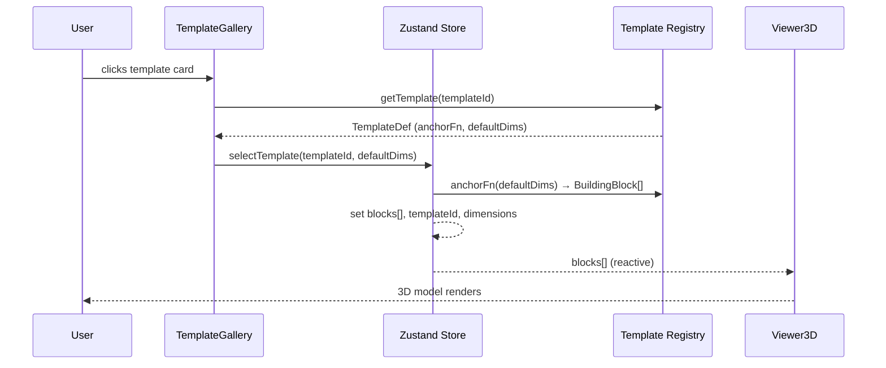
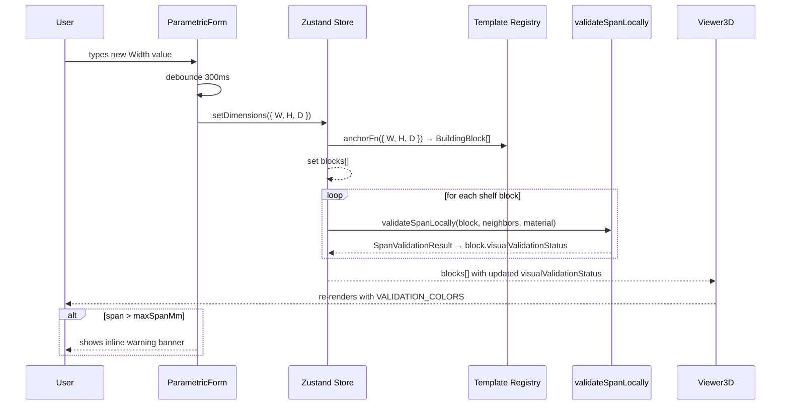

# Design Document: Template & Parametric Form

## Overview

This feature adds a **Templates layer** and a **Parametric Form** to the DoselCode furniture design platform. Users can select a pre-built furniture template (Alacena de Cocina, Escritorio Flotante, Rack de TV Bajo) from a visual gallery, then fine-tune its global dimensions (Width, Height, Depth) through a form that re-scales all constituent `BuildingBlock` pieces in real time using anchor functions. Every dimension change triggers local structural validation and reflects error states visually in the 3D viewer.

The feature integrates with the existing `BuildingBlock` model, `validateSpanLocally`, `VALIDATION_COLORS`, and the Zustand store that will be introduced to manage the global `blocks` array.

---

## Architecture

```mermaid
graph TD
    subgraph "UI Layer"
        TG[TemplateGallery.tsx]
        PF[ParametricForm.tsx]
    end

    subgraph "State Layer"
        ZS[Zustand Store\nuseFurnitureStore]
    end

    subgraph "Domain Layer"
        TR[Template Registry\nsrc/lib/templates/registry.ts]
        AF[Anchor Functions\nper-template]
        SV[validateSpanLocally\nstructuralValidator.ts]
    end

    subgraph "Rendering Layer"
        V3[Viewer3D.tsx\nBlockMesh + VALIDATION_COLORS]
    end

    TG -->|selectTemplate(id)| ZS
    PF -->|setDimensions(W,H,D)| ZS
    ZS -->|blocks[]| V3
    ZS -->|dimensions + templateId| PF
    ZS -->|templateId| TG
    TR -->|TemplateDef[]| TG
    TR -->|anchorFn(dims) → blocks[]| ZS
    ZS -->|blocks + material| SV
    SV -->|SpanValidationResult| ZS
    ZS -->|visualValidationStatus| V3
```

---

## Sequence Diagrams

### Template Selection Flow



### Parametric Form Dimension Change Flow



---

## Components and Interfaces

### Component 1: TemplateGallery

**Purpose**: Displays a visual grid of available furniture templates. On selection, loads the template's default dimensions and generated blocks into the Zustand store.

**Interface**:
```typescript
interface TemplateGalleryProps {
  /** Called when the user selects a template card */
  onSelect?: (templateId: TemplateId) => void;
}

export function TemplateGallery(props: TemplateGalleryProps): JSX.Element
```

**Responsibilities**:
- Render one `shadcn/ui Card` per entry in `TEMPLATE_REGISTRY`
- Display template name, base dimensions (W × H × D in mm), and piece count
- Highlight the currently active template (from Zustand `selectedTemplateId`)
- On click: call `store.selectTemplate(id)` which internally runs the anchor function and replaces `blocks[]`
- Accessible: each card is a `<button>` with `aria-pressed` reflecting selection state

---

### Component 2: ParametricForm

**Purpose**: Numeric inputs for Width, Height, and Depth that re-scale the active template's blocks in real time via anchor functions, with debounce and validation feedback.

**Interface**:
```typescript
interface ParametricFormProps {
  /** Fired after debounce when any dimension changes and validation completes */
  onDimensionsChange?: (dims: TemplateDimensions, hasErrors: boolean) => void;
}

export function ParametricForm(props: ParametricFormProps): JSX.Element
```

**Responsibilities**:
- Render three `<Input>` fields (W, H, D) bound to `store.dimensions`
- Apply 300 ms debounce before calling `store.setDimensions()`
- After each dimension update, call `validateSpanLocally` for every shelf block and surface warnings
- Show an inline `Alert` (shadcn/ui) when any block's `visualValidationStatus` is `'warning'` or `'error'`
- Disable inputs when no template is selected (`store.selectedTemplateId === null`)

---

### Component 3: Template Registry (`src/lib/templates/registry.ts`)

**Purpose**: Pure data module that defines all furniture templates and their anchor functions.

**Interface**:
```typescript
export type TemplateId = 'alacena-cocina' | 'escritorio-flotante' | 'rack-tv-bajo';

export interface TemplateDimensions {
  W: number; // total width in mm
  H: number; // total height in mm
  D: number; // total depth in mm
}

export interface TemplateDef {
  id: TemplateId;
  nameEs: string;
  defaultDimensions: TemplateDimensions;
  /** Pure function: given global dims, returns the full BuildingBlock[] */
  anchorFn: (dims: TemplateDimensions) => BuildingBlock[];
}

export const TEMPLATE_REGISTRY: Record<TemplateId, TemplateDef>

export function getTemplate(id: TemplateId): TemplateDef
```

**Responsibilities**:
- Define the three initial templates with their anchor functions
- Each anchor function is a pure function: same input → same output, no side effects
- Generate stable, deterministic UUIDs per piece using a seeded scheme (e.g. `${templateId}-${pieceName}`) so blocks don't flicker on re-render

---

### Component 4: Zustand Store (`src/lib/store/furnitureStore.ts`)

**Purpose**: Global state for the active template, current dimensions, and the derived `blocks[]` array.

**Interface**:
```typescript
interface FurnitureStoreState {
  selectedTemplateId: TemplateId | null;
  dimensions: TemplateDimensions;
  blocks: BuildingBlock[];
  validationErrors: boolean;

  selectTemplate: (id: TemplateId) => void;
  setDimensions: (dims: TemplateDimensions) => void;
  clearTemplate: () => void;
}

export const useFurnitureStore: UseBoundStore<StoreApi<FurnitureStoreState>>
```

**Responsibilities**:
- `selectTemplate`: look up `TemplateDef`, run `anchorFn(defaultDimensions)`, set `blocks[]`
- `setDimensions`: run `anchorFn(newDims)` for the active template, replace `blocks[]`
- Expose `validationErrors` flag derived from any block with `visualValidationStatus !== 'ok'`
- Integrate with existing `FurnitureModel` in `Index.tsx` by syncing `blocks` into `furnitureModel.blocks`

---

## Data Models

### TemplateDimensions

```typescript
interface TemplateDimensions {
  W: number; // total external width in mm (e.g. 800)
  H: number; // total external height in mm (e.g. 600)
  D: number; // total external depth in mm (e.g. 300)
}
```

**Validation Rules**:
- All values must be positive integers > 0
- W, H, D must each be ≥ 100 mm (minimum meaningful furniture dimension)
- W, H, D must each be ≤ 3000 mm (practical upper bound)

### TemplateDef

```typescript
interface TemplateDef {
  id: TemplateId;
  nameEs: string;
  defaultDimensions: TemplateDimensions;
  anchorFn: (dims: TemplateDimensions) => BuildingBlock[];
}
```

**Validation Rules**:
- `anchorFn` must be a pure function (no side effects, deterministic)
- All generated blocks must have `id` values stable across calls with the same `dims`
- All generated blocks must have non-overlapping AABBs (verified by property tests)

### Anchor Function Contract

The anchor function for each template encodes the assembly rules as positional formulas. The material thickness constant `T = 18` (mm) is used throughout.

**Example — Alacena de Cocina piece positions**:

| Piece | X (centre) | Y (centre) | Z (centre) | Size (x × y × z) |
|---|---|---|---|---|
| Left lateral | `T/2` | `H/2` | `D/2` | `T × H × D` |
| Right lateral | `W - T/2` | `H/2` | `D/2` | `T × H × D` |
| Techo interno | `W/2` | `H - T/2` | `D/2` | `(W-2T) × T × D` |
| Piso interno | `W/2` | `T/2` | `D/2` | `(W-2T) × T × D` |
| Estante central | `W/2` | `H/2` | `(D-20)/2 + 10` | `(W-2T-2) × T × (D-20)` |
| Fondo MDF | `W/2` | `H/2` | `1.5` | `W × H × 3` |
| Puerta izquierda | `W/4` | `H/2` | `D + T/2` | `(W/2-2) × (H-4) × T` |
| Puerta derecha | `3W/4` | `H/2` | `D + T/2` | `(W/2-2) × (H-4) × T` |

---

## Algorithmic Pseudocode

### Main Algorithm: Anchor Function Evaluation

```typescript
function anchorFn(dims: TemplateDimensions): BuildingBlock[] {
  // INPUT: dims — global W, H, D in mm
  // OUTPUT: BuildingBlock[] — all pieces with computed positions and sizes
  // PRECONDITION: dims.W > 0 && dims.H > 0 && dims.D > 0
  // POSTCONDITION: result.length === PIECE_COUNT_FOR_TEMPLATE
  //                ∀ block ∈ result: block.size.x > 0 && block.size.y > 0 && block.size.z > 0
  //                ∀ i,j ∈ result, i≠j: AABB(i) ∩ AABB(j) = ∅  (no overlaps)

  const T = 18; // material thickness in mm
  const { W, H, D } = dims;

  const blocks: BuildingBlock[] = [];

  // Each piece is defined by its anchor formula:
  //   position = f(W, H, D, T)   — centre of the block
  //   size     = g(W, H, D, T)   — dimensions of the block

  // LOOP INVARIANT: all blocks added so far have valid sizes and non-overlapping AABBs
  for (const pieceDef of PIECE_DEFINITIONS) {
    const position = pieceDef.positionFn(W, H, D, T);
    const size     = pieceDef.sizeFn(W, H, D, T);

    // Guard: skip degenerate pieces (size ≤ 0 on any axis)
    if (size.x <= 0 || size.y <= 0 || size.z <= 0) continue;

    blocks.push(makeBlock(pieceDef.id, pieceDef.type, position, size));
  }

  // POSTCONDITION CHECK (dev-only assertion):
  // assert(blocks.every(b => b.size.x > 0 && b.size.y > 0 && b.size.z > 0))

  return blocks;
}
```

**Preconditions**:
- `dims.W`, `dims.H`, `dims.D` are all positive numbers
- `T` (material thickness) is a positive constant (18 mm)

**Postconditions**:
- Returns an array with exactly `PIECE_COUNT` elements (or fewer if degenerate pieces are skipped)
- Every block has strictly positive size on all three axes
- No two blocks have overlapping AABBs (enforced by anchor formula design)

**Loop Invariants**:
- All previously added blocks have valid (positive) sizes
- No previously added block overlaps with any other previously added block

---

### Algorithm: setDimensions with Validation

```typescript
function setDimensions(dims: TemplateDimensions): void {
  // INPUT: dims — new global dimensions
  // PRECONDITION: selectedTemplateId !== null
  // POSTCONDITION: store.blocks reflects new dims; store.validationErrors reflects span checks

  const template = getTemplate(selectedTemplateId!);

  // 1. Re-run anchor function — pure, no side effects
  const newBlocks = template.anchorFn(dims);

  // 2. Run local span validation for each shelf block
  //    LOOP INVARIANT: all previously validated blocks have their visualValidationStatus set
  let hasErrors = false;
  for (const block of newBlocks) {
    if (block.type === 'shelf') {
      const neighbors = newBlocks.filter(b => b.id !== block.id);
      const result = validateSpanLocally(block, neighbors, selectedMaterial);
      if (result.status !== 'ok') hasErrors = true;
    }
  }

  // 3. Atomic state update
  set({ dimensions: dims, blocks: newBlocks, validationErrors: hasErrors });
}
```

**Preconditions**:
- `selectedTemplateId` is not null
- `dims` values are all positive

**Postconditions**:
- `store.blocks` is the result of `anchorFn(dims)` with `visualValidationStatus` set on each shelf block
- `store.validationErrors` is `true` iff any shelf block has `status !== 'ok'`
- State update is atomic (no intermediate partial state visible to subscribers)

**Loop Invariants**:
- All previously processed shelf blocks have their `visualValidationStatus` updated
- `hasErrors` is monotonically set to `true` once any error is found (never reset to `false` within the loop)

---

## Key Functions with Formal Specifications

### `getTemplate(id: TemplateId): TemplateDef`

```typescript
function getTemplate(id: TemplateId): TemplateDef
```

**Preconditions**:
- `id` is a valid `TemplateId` value (`'alacena-cocina'` | `'escritorio-flotante'` | `'rack-tv-bajo'`)

**Postconditions**:
- Returns the `TemplateDef` registered under `id`
- Never returns `undefined` (throws if id is unknown — compile-time safety via TypeScript union)

**Loop Invariants**: N/A

---

### `anchorFn(dims: TemplateDimensions): BuildingBlock[]`

```typescript
type AnchorFn = (dims: TemplateDimensions) => BuildingBlock[]
```

**Preconditions**:
- `dims.W > 0 && dims.H > 0 && dims.D > 0`
- `dims.W >= 2 * T + 2` (minimum width to fit two laterals plus clearance)

**Postconditions**:
- Result array length equals the template's defined piece count (minus any degenerate pieces)
- `∀ block ∈ result: block.size.x > 0 && block.size.y > 0 && block.size.z > 0`
- `∀ i ≠ j: AABB(result[i]) ∩ AABB(result[j]) = ∅`
- Block IDs are stable: `anchorFn(dims)[k].id === anchorFn(dims)[k].id` for any two calls with the same `dims`

**Loop Invariants**:
- All blocks appended so far have positive sizes and non-overlapping AABBs

---

### `validateSpanLocally` (existing, called by store)

```typescript
function validateSpanLocally(
  block: BuildingBlock,
  neighbors: BuildingBlock[],
  material: MaterialType,
): SpanValidationResult
```

**Preconditions** (from existing implementation):
- `block` is a valid `BuildingBlock` with positive size
- `neighbors` may be empty (returns `status: 'ok'`)
- `material` is a valid `MaterialType`

**Postconditions**:
- `result.status === 'ok'` iff `spanMm <= maxSpanMm`
- `result.status === 'warning'` iff `maxSpanMm * 0.9 < spanMm <= maxSpanMm`
- `result.status === 'error'` iff `spanMm > maxSpanMm`
- `block.visualValidationStatus` is mutated to match `result.status`

---

## Example Usage

### Selecting a template and rendering

```typescript
// In TemplateGallery.tsx
import { useFurnitureStore } from '@/lib/store/furnitureStore';

function TemplateGallery() {
  const { selectedTemplateId, selectTemplate } = useFurnitureStore();

  return (
    <div className="grid grid-cols-3 gap-4">
      {Object.values(TEMPLATE_REGISTRY).map((tpl) => (
        <Card
          key={tpl.id}
          className={selectedTemplateId === tpl.id ? 'border-primary' : ''}
          onClick={() => selectTemplate(tpl.id)}
          role="button"
          aria-pressed={selectedTemplateId === tpl.id}
        >
          <CardHeader>
            <CardTitle>{tpl.nameEs}</CardTitle>
          </CardHeader>
          <CardContent>
            <p className="text-xs text-muted-foreground">
              {tpl.defaultDimensions.W} × {tpl.defaultDimensions.H} × {tpl.defaultDimensions.D} mm
            </p>
          </CardContent>
        </Card>
      ))}
    </div>
  );
}
```

### Parametric form with debounce and validation warning

```typescript
// In ParametricForm.tsx
import { useFurnitureStore } from '@/lib/store/furnitureStore';
import { useDebounce } from '@/hooks/useDebounce';

function ParametricForm() {
  const { dimensions, setDimensions, validationErrors, selectedTemplateId } =
    useFurnitureStore();
  const [localDims, setLocalDims] = useState(dimensions);
  const debouncedDims = useDebounce(localDims, 300);

  useEffect(() => {
    if (selectedTemplateId) setDimensions(debouncedDims);
  }, [debouncedDims, selectedTemplateId]);

  return (
    <div className="space-y-4">
      {validationErrors && (
        <Alert variant="destructive">
          <AlertDescription>
            El vano supera el límite del material. Reduce el ancho o cambia el material.
          </AlertDescription>
        </Alert>
      )}
      <div className="grid grid-cols-3 gap-3">
        {(['W', 'H', 'D'] as const).map((dim) => (
          <div key={dim}>
            <Label htmlFor={`dim-${dim}`}>{dim} (mm)</Label>
            <Input
              id={`dim-${dim}`}
              type="number"
              value={localDims[dim]}
              min={100}
              max={3000}
              disabled={!selectedTemplateId}
              onChange={(e) =>
                setLocalDims((prev) => ({ ...prev, [dim]: Number(e.target.value) }))
              }
            />
          </div>
        ))}
      </div>
    </div>
  );
}
```

### Anchor function for Alacena de Cocina

```typescript
// In src/lib/templates/registry.ts
const alacenaAnchorFn: AnchorFn = ({ W, H, D }) => {
  const T = 18;
  return [
    makeBlock('alacena-lateral-izq',   'side-panel', { x: T/2,       y: H/2, z: D/2 }, { x: T, y: H, z: D }),
    makeBlock('alacena-lateral-der',   'side-panel', { x: W - T/2,   y: H/2, z: D/2 }, { x: T, y: H, z: D }),
    makeBlock('alacena-techo',         'shelf',      { x: W/2,       y: H - T/2, z: D/2 }, { x: W-2*T, y: T, z: D }),
    makeBlock('alacena-piso',          'shelf',      { x: W/2,       y: T/2, z: D/2 }, { x: W-2*T, y: T, z: D }),
    makeBlock('alacena-estante',       'shelf',      { x: W/2,       y: H/2, z: (D-20)/2 + 10 }, { x: W-2*T-2, y: T, z: D-20 }),
    makeBlock('alacena-fondo',         'back-panel', { x: W/2,       y: H/2, z: 1.5 }, { x: W, y: H, z: 3 }),
    makeBlock('alacena-puerta-izq',    'side-panel', { x: W/4,       y: H/2, z: D + T/2 }, { x: W/2-2, y: H-4, z: T }),
    makeBlock('alacena-puerta-der',    'side-panel', { x: 3*W/4,     y: H/2, z: D + T/2 }, { x: W/2-2, y: H-4, z: T }),
  ];
};
```

---

## Correctness Properties

These properties are expressed as property-based test descriptions (fast-check + Vitest):

**P-TPF-1: Anchor function produces non-overlapping blocks for any valid dimensions**
- `∀ dims ∈ ValidDimensions, ∀ templateId ∈ TemplateId:`
  `∀ i ≠ j ∈ anchorFn(dims): AABB(blocks[i]) ∩ AABB(blocks[j]) = ∅`

**P-TPF-2: All generated blocks have strictly positive sizes**
- `∀ dims ∈ ValidDimensions, ∀ block ∈ anchorFn(dims):`
  `block.size.x > 0 ∧ block.size.y > 0 ∧ block.size.z > 0`

**P-TPF-3: Anchor function is pure (same input → same output)**
- `∀ dims ∈ ValidDimensions: anchorFn(dims) deep-equals anchorFn(dims)`
- Block IDs are stable across calls

**P-TPF-4: Validation warning fires iff span exceeds material limit**
- `∀ dims ∈ ValidDimensions, ∀ shelf ∈ anchorFn(dims):`
  `validateSpanLocally(shelf, neighbors, material).status !== 'ok'`
  `⟺ computedSpan > MATERIAL_SPECS[material].maxSpanMm * 0.9`

**P-TPF-5: Dimension change preserves assembly topology**
- `∀ dims1, dims2 ∈ ValidDimensions:`
  `anchorFn(dims1).length === anchorFn(dims2).length`
  (piece count is invariant under dimension changes)

**P-TPF-6: Right lateral always anchored at X = W - T/2**
- `∀ dims ∈ ValidDimensions:`
  `rightLateral(anchorFn(dims)).position.x === dims.W - T/2`

---

## Error Handling

### Error Scenario 1: Degenerate dimensions (piece size ≤ 0)

**Condition**: User enters a Width so small that `W - 2T - 2 ≤ 0` (e.g. W = 30 mm for Alacena)
**Response**: The anchor function skips pieces with non-positive size (guard clause). The form shows a validation error: "Las dimensiones son demasiado pequeñas para este template."
**Recovery**: User increases the dimension above the minimum threshold. The form re-enables the submit path once all pieces are valid.

### Error Scenario 2: Span exceeds material limit

**Condition**: `validateSpanLocally` returns `status: 'error'` for a shelf block
**Response**: `store.validationErrors = true`; `ParametricForm` renders a destructive `Alert`; affected blocks render in `VALIDATION_COLORS.error` (`#FF0000`) in `Viewer3D`
**Recovery**: User reduces Width or changes material to one with a higher `maxSpanMm`

### Error Scenario 3: No template selected

**Condition**: `store.selectedTemplateId === null` when `ParametricForm` is rendered
**Response**: All dimension inputs are `disabled`; a placeholder message "Selecciona un template para editar dimensiones" is shown
**Recovery**: User selects a template from `TemplateGallery`

### Error Scenario 4: Zustand not installed

**Condition**: `zustand` package is missing from `node_modules`
**Response**: Build fails with a clear module-not-found error
**Recovery**: Run `npm install zustand@^4.5.2` before building

---

## Testing Strategy

### Unit Testing Approach

Each anchor function is a pure function and can be tested exhaustively with fixed inputs:
- Verify piece count matches expected value
- Verify each piece's position and size formula for the default dimensions
- Verify edge cases: minimum valid dimensions, maximum valid dimensions

### Property-Based Testing Approach

**Property Test Library**: `fast-check` (already installed)

Key arbitraries:
```typescript
const validDimsArb = fc.record({
  W: fc.integer({ min: 100, max: 3000 }),
  H: fc.integer({ min: 100, max: 3000 }),
  D: fc.integer({ min: 100, max: 3000 }),
});

const templateIdArb = fc.constantFrom(
  'alacena-cocina', 'escritorio-flotante', 'rack-tv-bajo'
);
```

Properties to test (P-TPF-1 through P-TPF-6 above).

### Integration Testing Approach

- Render `TemplateGallery` + `ParametricForm` together with a mocked Zustand store
- Verify that clicking a template card populates the form with default dimensions
- Verify that changing a dimension triggers `setDimensions` after 300 ms debounce
- Verify that `Viewer3D` receives updated `blocks[]` after dimension change

---

## Performance Considerations

- **Anchor functions are pure and O(n)** where n = piece count (≤ 10 pieces per template). Re-computation on every keystroke (after debounce) is negligible.
- **Debounce of 300 ms** prevents excessive re-renders during rapid typing.
- **Zustand** updates `blocks[]` outside React's render cycle, avoiding cascading re-renders. `Viewer3D` subscribes only to `blocks`, so unrelated state changes don't trigger 3D re-renders.
- **Stable block IDs** (e.g. `'alacena-lateral-izq'`) allow React Three Fiber to reuse existing mesh objects via `key` prop, avoiding geometry disposal/recreation on every dimension change.

---

## Security Considerations

- All dimension inputs are validated client-side (min/max bounds, numeric type) before being passed to anchor functions. No server-side calls are made by this feature.
- Anchor functions are pure TypeScript — no `eval`, no dynamic code execution.
- Template definitions are static constants bundled at build time; no external data loading.

---

## Dependencies

| Dependency | Version | Purpose |
|---|---|---|
| `zustand` | `^4.5.2` | Global state for active template, dimensions, blocks |
| `shadcn/ui Card` | already installed | Template gallery cards |
| `shadcn/ui Alert` | already installed | Validation warning banner |
| `shadcn/ui Input` | already installed | Dimension inputs |
| `shadcn/ui Label` | already installed | Input labels |
| `fast-check` | already installed | Property-based tests |
| `vitest` | already installed | Test runner |

**New file additions**:
- `src/lib/templates/registry.ts` — template definitions and anchor functions
- `src/lib/store/furnitureStore.ts` — Zustand store
- `src/components/TemplateGallery.tsx` — gallery UI
- `src/components/ParametricForm.tsx` — parametric form UI
- `src/hooks/useDebounce.ts` — debounce hook (if not already present)
- `src/test/templateRegistry.test.ts` — property-based tests for anchor functions
